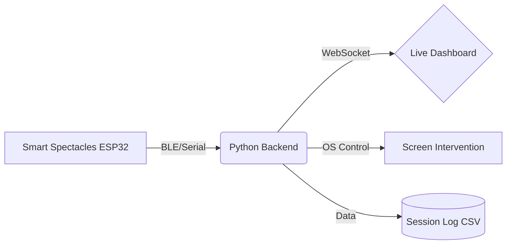

<div align="center">
  <h1>👁️ Netra Rakshaka</h1>
  <p><strong>Intelligent Wearable System for Real-Time Vision Risk Awareness and Cyber-Physical Eye Protection</strong></p>
</div>

<br />

## 📖 Overview

**Netra Rakshaka** is a camera-free, multi-modal IoT spectacle system designed to combat digital eye strain (Computer Vision Syndrome). It detects eye strain physiologically using thermal ocular temperature monitoring and sensor fusion, predicts long-term vision risk using Edge AI and LSTM forecasting, and actively enforces eye care protocols through a closed-loop biometric-to-display cyber-physical intervention mechanism.

---

## ✨ Key Features

### 🔵 Core Biometric Monitoring
- **Real-Time Blink Rate Monitoring**: Uses IR sensors to track blinks per minute.
- **Thermal Tear Film Detection**: Measures eye surface temperature to detect tear evaporation.
- **Screen Distance & Posture**: Monitors viewing distance (ToF) and Text Neck (IMU).
- **Environmental Context**: Tracks room humidity, temperature, and ambient lux.

### 🟡 AI & Intelligence
- **Real-Time Edge AI**: TinyML 1D CNN classification running directly on the ESP32 chip.
- **Vision Risk Forecasting**: PyTorch LSTM time-series modeling to predict strain 30 minutes into the future.
- **Personalized Baseline Calibration**: Learns your natural healthy baseline over time.

### 🟢 Active Interventions
- **Cyber-Physical Screen Dimming**: Automatically dims your computer screen when critical strain is detected, enforcing a 20-second break.
- **Premium Live Dashboard**: A modern, glassmorphic SaaS-style web portal for real-time biometric telemetry.

---

## 🏗️ System Architecture



---

## 🚀 Getting Started (Software Simulation Demo)

To run the software-only simulation demo for presentation purposes:

### 1. Prerequisites
- Python 3.9+
- Windows OS (required for `wmi` screen dimming)

### 2. Installation
Clone the repository and install dependencies:
```bash
git clone https://github.com/VasundharaDP123/Netra-Rakshaka.git
cd Netra-Rakshaka
pip install -r requirements.txt
pip install python-socketio[client]
```

### 3. Running the Demo
You need to run the backend server and the intervention script simultaneously.

**Terminal 1 (Backend & Dashboard):**
```bash
python app.py
```

**Terminal 2 (Intervention Script):**
```bash
python screen_control.py
```

**View Dashboard:**
Open your browser and navigate to `http://localhost:5000`

---

## 💻 Tech Stack
- **Hardware**: ESP32-S3 Mini, MLX90614, VL53L0X, MPU6050, BME680, BH1750
- **Backend**: Python, Flask, SocketIO, Pandas
- **Frontend**: HTML5, CSS3 (Glassmorphism), Chart.js, Particles.js
- **Machine Learning**: Edge Impulse (TinyML), PyTorch (LSTM)
- **OS Control**: `wmi`, `ctypes`, `tkinter`

---

## 📝 Patent Claims
1. Thermal Ocular Surface Temperature Monitoring for Dry Eye Detection on a Consumer Wearable.
2. Closed-Loop Cyber-Physical Biometric-to-Display Actuation Method.
3. Multi-Modal Environmental and Physiological Sensor Fusion for Context-Aware Dry Eye Risk Prediction.

<br />

<div align="center">
  <p>Built for the Future of Eye Health 👁️</p>
</div>
