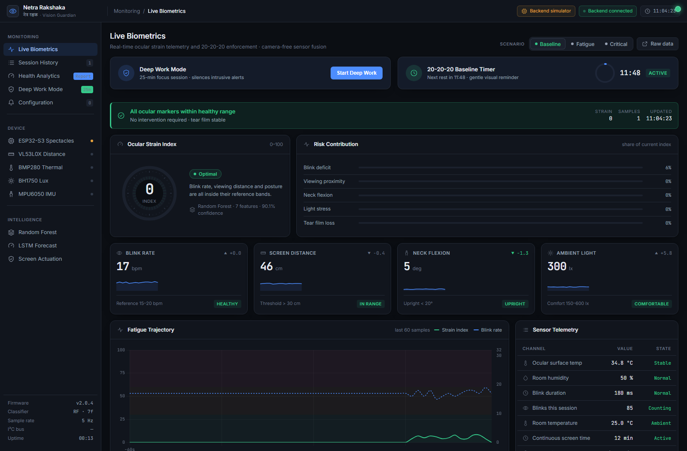
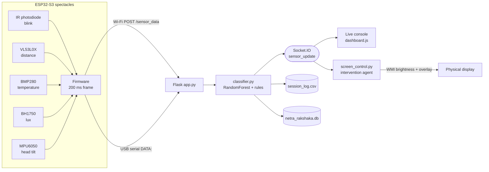

<div align="center">

# Netra Rakshaka · नेत्र रक्षक

**Camera-free smart spectacles that measure digital eye strain and act on it.**

Wearable sensor fusion → strain classification → a live operations console → an enforced eye break.

[](https://www.python.org/)
[](https://flask-socketio.readthedocs.io/)
[](https://platformio.org/)
[](https://scikit-learn.org/)
[](#3-optional-enforced-break-agent)

</div>

---

## Overview

Computer Vision Syndrome is driven by things you cannot feel happening: your blink rate collapses, you drift closer to the screen, your neck flexes forward, and the tear film dries out. **Netra Rakshaka** instruments those four signals on a pair of ESP32-S3 spectacles — with **no camera anywhere in the system** — classifies the resulting strain in real time, and closes the loop by dimming the display and enforcing a 20-second recovery break.

The repository contains the complete working system:

| Layer | What it does |
|---|---|
| **Firmware** | ESP32-S3 samples five sensors and emits a JSON telemetry frame every 200 ms over USB serial or Wi-Fi |
| **Backend** | Flask + Socket.IO ingests telemetry, classifies strain, logs to CSV + SQLite, and streams to the browser |
| **Console** | A live operations dashboard: strain index, risk contribution, 20-20-20 timer, Deep Work Mode, analytics |
| **Actuation** | A separate agent that dims the physical display and holds a full-screen break when strain stays Critical |

<div align="center">
  
  <sub><em>The live console — strain index, risk contribution, KPI trends, telemetry table and event log.</em></sub>
</div>

---

## How it works



**Telemetry precedence.** `get_active_sensor_data()` prefers a Wi-Fi frame received in the last 30 s, falls back to the disk cache, then to USB serial, and finally to the built-in simulator — so the console always renders, with the active source labelled in the top bar.

**Sensor honesty.** When the firmware reports a sensor as not responding (`tof_ok`, `bmp_ok`, `bh_ok`, `mpu_ok`), the backend substitutes a simulated value **for that field only** and lists it in `simulated_fields`. A dead sensor sends `0`, which is a plausible-looking reading that would otherwise poison both the chart and the classifier.

A detailed hardware diagram is in [`Architecture_Diagram.png`](Architecture_Diagram.png).

---

## Repository layout

| Path | Purpose |
|---|---|
| `app.py` | Flask + Socket.IO server, telemetry ingest, 5 Hz stream loop, REST API |
| `classifier.py` | Strain classification — RandomForest with a rule-based fallback |
| `simulator.py` | USB-serial reader, sensor-health substitution, and the demo scenario model |
| `screen_control.py` | Intervention agent: brightness control + full-screen enforced break |
| `session_logger.py` | Append-only CSV telemetry log |
| `database.py` | SQLite schema and queries (telemetry, breaks, settings, compliance, focus sessions) |
| `train_classifier.py` | Retrains the RandomForest from `data/session_log.csv` |
| `templates/dashboard.html` | Console markup, icon sprite, modals |
| `static/js/dashboard.js` | Console controller: telemetry, charts, 20-20-20, Deep Work, analytics |
| `static/css/dashboard.css` | Console design system |
| `firmware/src/main.cpp` | ESP32-S3 firmware |
| `models/` | Trained `strain_classifier.pkl` and `scaler.pkl` |
| `data/` | `session_log.csv`, `netra_rakshaka.db`, `breaks_log.txt`, `wifi_cache.json` |

---

## Quick start

### Prerequisites

- Python 3.9+
- Windows, if you want the physical screen-dimming agent (`wmi`); the server and console run anywhere
- Hardware is **optional** — without spectacles the backend streams its own simulator

### 1. Install

```bash
git clone https://github.com/VasundharaDP123/Netra-Rakshaka.git
cd Netra-Rakshaka
pip install -r requirements.txt
pip install "python-socketio[client]"     # only needed for screen_control.py
```

### 2. Run the server

```bash
python app.py
```

Open **http://127.0.0.1:5000**. The terminal prints one live telemetry line per 250 ms:

```
📡 [LIVE SENSORS] 🟢 Strain: Safe     ( 8/100) | Distance: 46cm | Blink Rate: 17/min | Blinks:  85 | Env Temp: 34.8°C | Head Tilt:  5° | Lux:   300
```

> **Windows tip:** if you redirect that output to a file (`python app.py > log.txt`), the emoji will raise `UnicodeEncodeError` under the default `cp1252` codepage and kill the telemetry thread. Set `PYTHONIOENCODING=utf-8` first.

### 3. Optional: enforced break agent

In a second terminal:

```bash
python screen_control.py
```

It connects to the server over Socket.IO and, after a 60-second startup grace period, dims the display to 20 % and holds a full-screen break for 20 seconds once strain has been Critical for ~3 seconds of continuous packets. A 50-second cooldown prevents break loops. Every break is appended to `data/breaks_log.txt`.

---

## Hardware

| Component | Interface | Measures | Telemetry field |
|---|---|---|---|
| IR photodiode (TCRT5000 / HW-870) | GPIO 4 (ADC) | Blink events, closure duration, drowsiness | `blink_rate`, `blink_count`, `blink_duration_ms` |
| VL53L0X | I²C `0x29` | Eye-to-screen distance | `screen_distance_cm` |
| BMP280 | I²C `0x76` / `0x77` | Surface / ambient temperature | `eye_temp_celsius`, `room_temp_celsius` |
| BH1750 | I²C `0x23` | Ambient illuminance | `ambient_lux` |
| MPU6050 | I²C `0x68` / `0x69` | Head tilt (text-neck posture) | `head_tilt_degrees` |
| Coin vibration motor | GPIO 5 | Haptic alert (`ENABLE_HAPTIC`, off by default) | — |

Default I²C pins are `SDA 8` / `SCL 9` at 100 kHz, with automatic bus recovery after 25 consecutive failures.

> **No humidity sensor is fitted.** The firmware reports a fixed `room_humidity_pct: 50` and flags it with `humidity_ok: 0`; the console labels that channel **Not measured** rather than passing it off as a reading.

### Blink detection

Rather than a fixed threshold, the firmware tracks a slow-moving reference of the open-eye signal (`τ ≈ 1 s`) and trips at 5× the measured noise of that signal, so it survives ambient-light drift. Closures shorter than 30 ms are rejected as electrical noise, longer than 900 ms count as a squint, and 1200 ms registers a drowsiness event.

### Build and flash

```bash
cd firmware
pio run --target upload
pio device monitor        # 115200 baud
```

### Telemetry contract

```json
{
  "blink_rate": 17, "blink_count": 85, "blink_duration_ms": 180,
  "eye_temp_celsius": 34.8, "room_temp_celsius": 25.0,
  "screen_distance_cm": 46, "ambient_lux": 300,
  "room_humidity_pct": 50, "head_tilt_degrees": 5, "drowsy_events": 0,
  "tof_ok": 1, "bmp_ok": 1, "bh_ok": 1, "mpu_ok": 1, "humidity_ok": 0,
  "i2c": "0x29,0x68,0x76", "sda": 1, "scl": 1
}
```

Over USB serial each frame is prefixed with `DATA:`; over Wi-Fi it is POSTed as JSON to `/sensor_data`. The backend adds `strain_level`, `strain_score`, `continuous_screen_time_min` and `_source` before broadcasting.

---

## Strain classification

`classify_strain()` runs in three stages:

1. **Hard clinical rule** — a blink rate below 8 bpm sustained past the first minute of screen time is Critical (score 95), regardless of the model. Tear-film breakup at that rate is not a judgement call.
2. **RandomForest** — seven features (`blink_rate`, `blink_duration_ms`, `eye_temp_celsius`, `screen_distance_cm`, `ambient_lux`, `room_humidity_pct`, `head_tilt_degrees`) scaled by the persisted `StandardScaler`. The strain score is `(1 − P(Safe)) × 100`.
3. **Rule-based fallback** — used when the model files are missing or inference fails: additive penalties for close viewing, low ocular temperature, dry air, dim light and forward head tilt, thresholded at 30 (Moderate) and 60 (Critical).

Retrain from your own logged sessions:

```bash
python train_classifier.py     # reads data/session_log.csv, writes models/*.pkl
```

---

## The console

### Live monitoring

- **Ocular Strain Index** — 0–100 with an iris gauge whose pupil constricts as strain rises
- **Risk Contribution** — how much each modality contributes: blink deficit, proximity, neck flexion, light stress, tear film
- **KPI cards** — blink rate, distance, neck flexion, ambient light, each with a rolling delta, sparkline and reference band
- **Fatigue Trajectory** — 60-sample strain and blink history over safe/moderate/critical reference bands
- **Event log** — state transitions, threshold breaches, sensor health and interventions. Threshold rules use hysteresis plus a 3-sample confirmation, so a value resting on its limit does not log a row every second
- **Device rail** — per-sensor health from the firmware's `*_ok` flags

### 20-20-20 baseline timer

A gentle, always-present rest cycle, independent of strain alerts:

- Counts down **only during active screen use** (distance < 60 cm); pauses otherwise
- **Reset by any stronger intervention** — an enforced break or a new Critical episode restarts the cycle instead of stacking a second prompt on it
- **Held during Deep Work** — the clock stops where it is and no prompt can fire, so a focus session is never interrupted; it resumes when the session ends. A rest the wearer asks for themselves still opens
- At zero, a 20-second guided rest: look away, focus ~20 feet, blink fully ten times
- **Compliance is recorded** as `complied` / `skipped` / `ignored` — behavioural data for the forecasting work

### Deep Work Mode

A 25-minute focus window that silences intrusive alerts without silencing genuine emergencies:

| Rule | Behaviour |
|---|---|
| Start under Critical strain | **Blocked**, with an explicit "Start anyway" override |
| Enforced break during a session | Suppressed and counted, shown as a visual breakthrough banner instead |
| 20-20-20 rest during a session | Held: the rest clock pauses and no prompt fires until the session ends |
| Critical strain during a session | Breaks through with a distinct banner; episodes counted once each, not per second |
| Sustained Critical > 2 minutes | Session **auto-ends** and a rest opens |
| Chained focus ≥ 50 minutes | Flagged as a strain risk; only a complied rest resets the chain |
| Session end | Summary: duration, critical episodes, breaks held back |

Physical screen dimming stays with `screen_control.py` and is **never** suppressed by the console.

### Health Analytics and Configuration

Analytics paints the live session buffer immediately, then widens to the recorded history for 24-hour and 7-day windows: active screen time, average blink rate, distance compliance, strain distribution, and a break-compliance and focus-behaviour panel. Configuration persists locally and applies to the running session — sensitivity sets the rest interval (Normal 20 / Sensitive 15 / Strict 12 min), the distance and blink thresholds feed the alert rules, cooldown feeds break enforcement, and the sound toggle mutes audio cues.

---

## API

### HTTP

| Method | Endpoint | Purpose |
|---|---|---|
| `GET` | `/` | The console |
| `POST` | `/sensor_data` | Wi-Fi telemetry ingest from the spectacles |
| `GET` | `/api/history?limit=N` | Last *N* rows of the CSV session log |
| `GET` | `/api/analytics?window=daily\|weekly` | Aggregated strain, blink and compliance summary |
| `GET` `POST` | `/api/settings` | Read / update user thresholds |
| `POST` | `/api/compliance` | Record a 20-20-20 outcome (`complied`, `skipped`, `ignored`) |
| `POST` | `/api/log_break` | Record an enforced break |
| `POST` | `/api/deep_work_start` | Begin a focus session |
| `POST` | `/api/deep_work_complete` | Close a focus session with its alert count |
| `POST` | `/api/scenario` | Switch the simulator profile (`Normal`, `Degrading`, `Critical`) |

### Socket.IO

| Event | Direction | Payload |
|---|---|---|
| `sensor_update` | server → clients | Full telemetry frame plus `strain_level`, `strain_score`, `_source` |
| `deep_work_event` | server → clients | `{ action: "start" \| "complete", … }` |

---

## Data

| Store | Contents |
|---|---|
| `data/session_log.csv` | Every classified frame: timestamp, seven features, strain level and score — the training set for `train_classifier.py`. Written on every run and **not tracked in git**; it is recreated automatically when the server starts |
| `data/sample_session_log.csv` | A 1,000-row sample of the above, committed so the schema and a usable example travel with the repository |
| `data/netra_rakshaka.db` | SQLite: `telemetry_history`, `break_events`, `user_settings`, `compliance_log`, `deep_work_sessions` |
| `data/breaks_log.txt` | Plain-text audit trail of enforced breaks |
| `data/wifi_cache.json` | Last Wi-Fi frame, used as a cross-process cache |

---

## Troubleshooting

| Symptom | Cause and fix |
|---|---|
| Console shows **Local simulation** | No `sensor_update` packets are arriving — check the server is running and the telemetry thread has not died |
| Strain pinned at **Critical (95)** with no hardware | The backend simulator reports `blink_rate: 0`, which the hard clinical rule reads as Critical after one minute. Expected without spectacles |
| Dashboard changes do not appear | `app.py` runs with `debug=False`, so Jinja caches the template — restart the server, and hard-refresh for CSS/JS |
| `UnicodeEncodeError: charmap` on start-up | Emoji in the telemetry print under Windows `cp1252`; set `PYTHONIOENCODING=utf-8` |
| Sensor shows red in the device rail | The firmware reports it off the I²C bus; the field is substituted and listed in `simulated_fields` |
| No screen dimming | `screen_control.py` is Windows-only and needs `wmi`; brightness control also requires a display that exposes `WmiMonitorBrightnessMethods` |

---

## Roadmap

The following are **planned, not yet implemented** in this repository:

- On-device TinyML classification, so the spectacles can act without a host
- LSTM time-series forecasting of strain risk (the console reserves a slot for it)
- Personalised baseline calibration per wearer
- BLE transport as an alternative to Wi-Fi and USB serial

### Known limitations

- **The shipped model is binary.** `models/strain_classifier.pkl` was trained on a log containing only `Safe` and `Critical` rows, so it cannot predict `Moderate` — that state currently reaches the console only through the rule-based fallback. The log is also dominated by `blink_rate: 0` (no spectacles attached) and by fixed simulator constants, so the model has largely learned *sensor absence* rather than physiology. Retraining on real wear data, with all three classes represented, is the highest-value next step
- Humidity is a fixed placeholder — no humidity sensor is fitted

---

## Patent claims

1. Thermal ocular surface temperature monitoring for dry-eye detection on a consumer wearable.
2. Closed-loop cyber-physical biometric-to-display actuation method.
3. Multi-modal environmental and physiological sensor fusion for context-aware dry-eye risk prediction.

---

## License

No licence has been declared for this repository. All rights are reserved by the author; please ask before reuse.

<div align="center">
  <sub><strong>नेत्र रक्षक</strong> — protector of the eyes.</sub>
</div>
